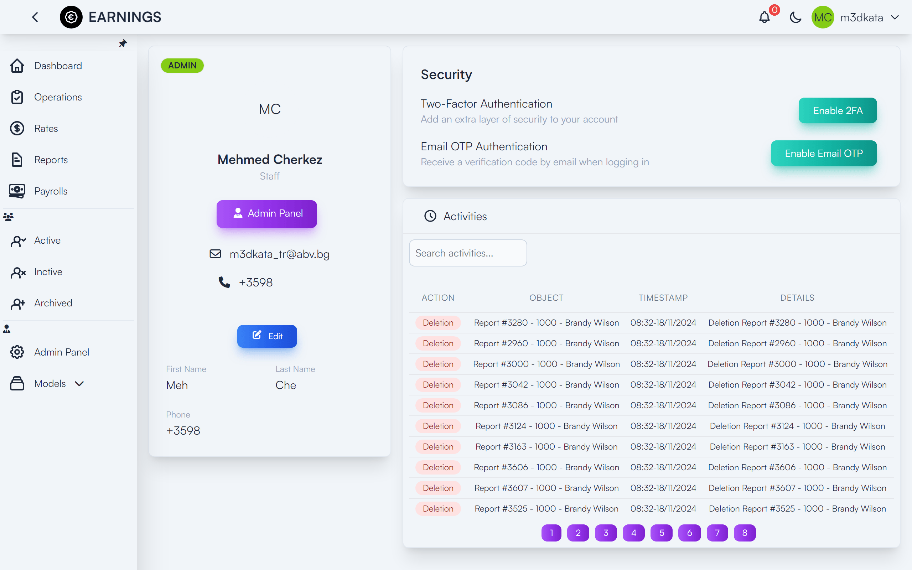
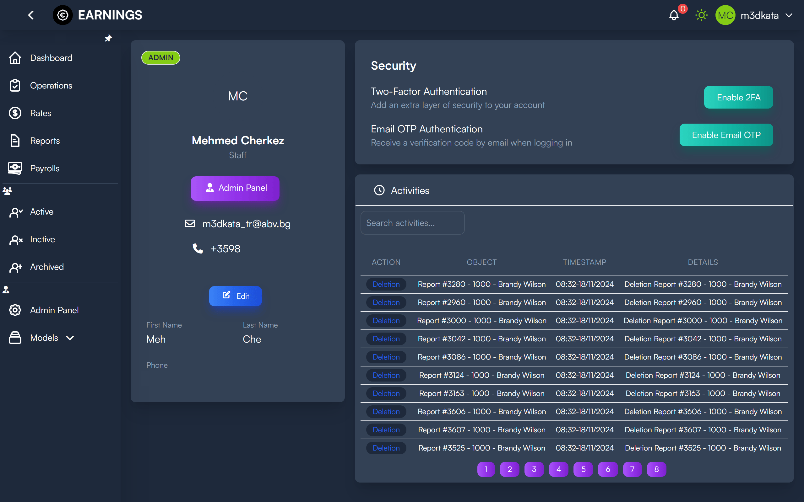
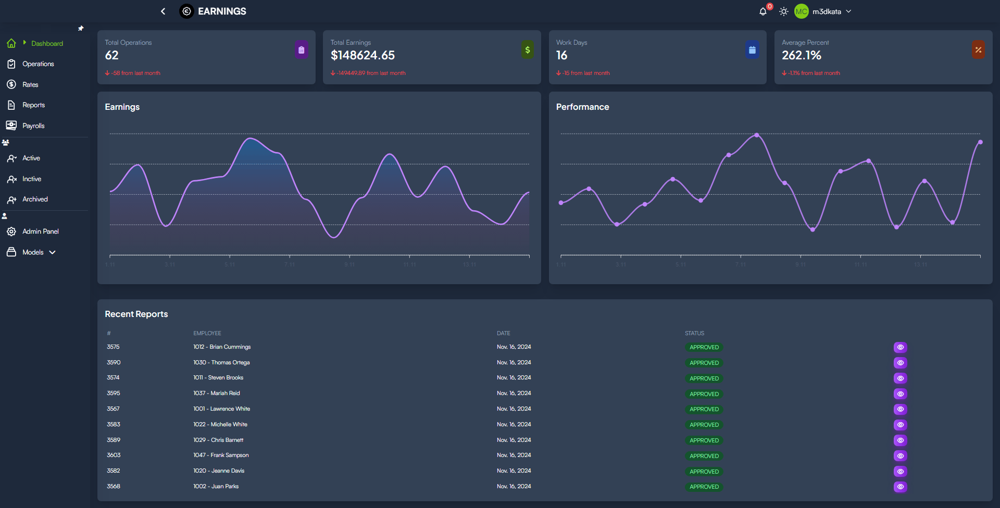
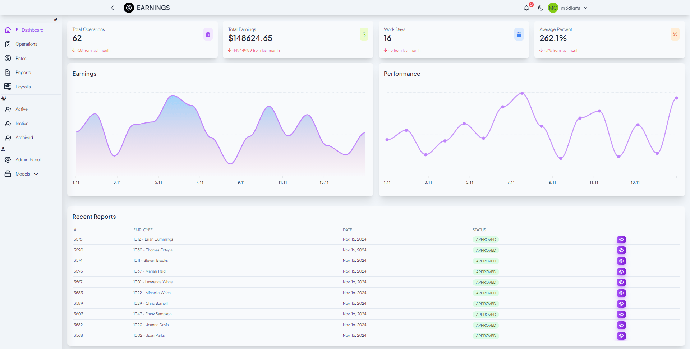
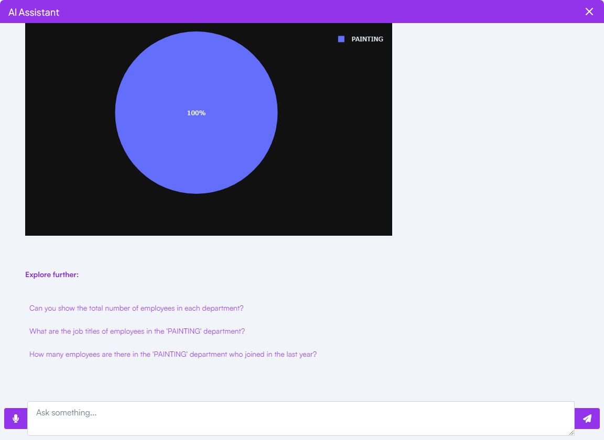
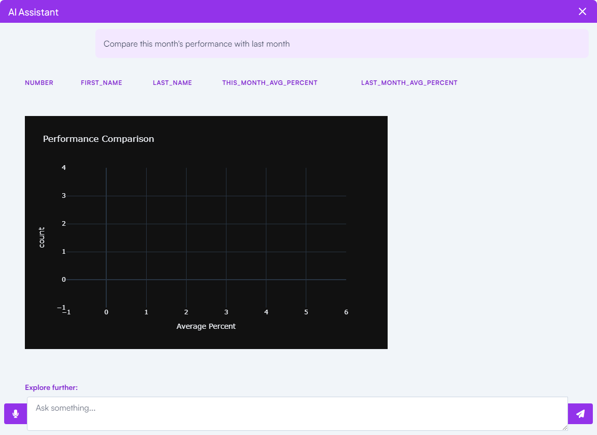
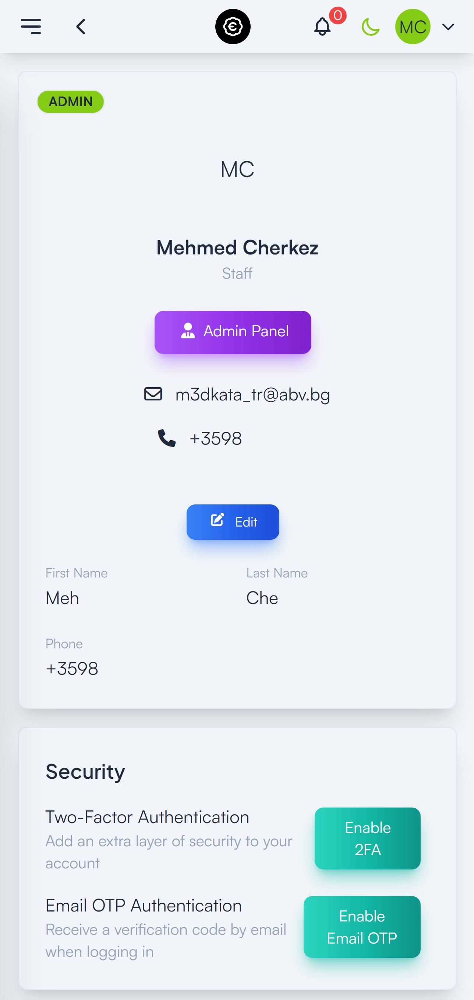
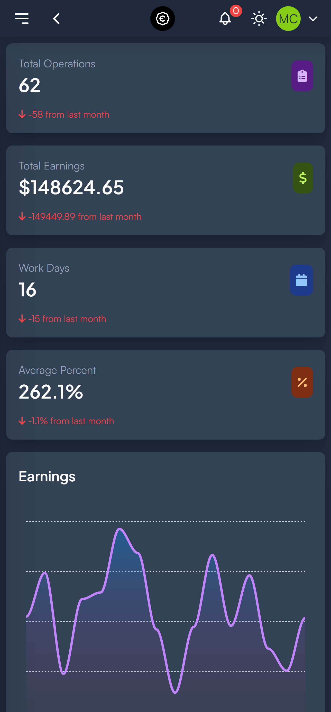

<div align="center">
    

  <h1>EARNINGS Platform</h1>
  
  <p>
    A robust Django-based platform for managing employee earnings, payrolls with API, real-time notifications and AI-powered reporting.
  </p>
  
  
<!-- Badges -->
<p>
  <a href="https://github.com/m3dkata/earnings-platform/graphs/contributors">
    
  </a>
  <a href="">
    
  </a>
  <a href="https://github.com/m3dkata/earnings-platform/network/members">
    
  </a>
  <a href="https://github.com/m3dkata/earnings-platform/stargazers">
    
  </a>
  <a href="https://github.com/m3dkata/earnings-platform/issues/">
    
  </a>
</p>
   
<h4>
    <a href="https://exam.kidn3y.com">View Demo</a>
  <span> · </span>
    <a href="https://github.com/m3dkata/earnings-platform/issues/">Request Feature</a>
  </h4>
</div>
<div align="center">

## 🌟 Demo Credentials

| Role     | Username | Password    |
|----------|----------|-------------|
| Admin    | admin123 | admin123    |
| Employee | employee0| password123 |                            |

</div>
<br>
<div align="center">
📚 Table of Contents

| [📸 Screenshots](#camera-screenshots) | [👾 Tech Stack](#space_invader-tech-stack) | [🎯 Features](#dart-features) | [🔑 Environment](#key-environment-variables) |
|:---:|:---:|:---:|:---:|

| [🐳 Run in Docker](#whale-run-in-docker) | [🚀 Run Locally](#running-run-locally) |
|:---:|:---:|
</div>

<div align="center"> 
<!-- Screenshots -->

### :camera: Screenshots

  

  
  
  <br>
  
  
  <br   >
  
  
  
  
</div>

<!-- TechStack -->

### :space_invader: Tech Stack

<details>
  <summary>Backend</summary>
  <ul>
    <li><a href="https://www.djangoproject.com/">Django</a></li>
    <li><a href="https://channels.readthedocs.io/en/stable/">Django Channels</a></li>
    <li><a href="https://www.django-rest-framework.org/">Django REST Framework</a></li>
    <li><a href="https://www.postgresql.org/docs/15/">PostgreSQL</a></li>
    <li><a href="https://redis.io/">Redis</a></li>
    <li><a href="https://docs.celeryproject.org/">Celery</a></li>
    <li><a href="https://github.com/django/daphne">Daphne</a> / <a href="https://gunicorn.org/">Gunicorn</a></li>
    <li><a href="https://django-rest-framework-simplejwt.readthedocs.io/en/latest/">JWT Authentication</a></li>
  </ul>
</details>

<details>
  <summary>Frontend</summary>
  <ul>
    <li><a href="https://tailwindcss.com/">Tailwind CSS</a>(django-tailwind)</li>
    <li><a href="https://htmx.org/">HTMX</a></li>
    <li><a href="https://docs.djangoproject.com/en/stable/ref/templates/">Django Templates</a></li>
    <li><a href="https://alpinejs.dev/">AlpineJS</a></li>
  </ul>
</details>

<details>
  <summary>Infrastructure</summary>
  <ul>
    <li><a href="https://www.docker.com/">Docker</a></li>
    <li><a href="https://docs.docker.com/compose/">Docker Compose</a></li>
    <li><a href="https://whitenoise.evans.io/">Whitenoise for Static Files</a></li>
    <li><a href="https://asgi.readthedocs.io/en/latest/">ASGI</a> / <a href="https://wsgi.readthedocs.io/">WSGI</a></li>
  </ul>
</details>

<details>
  <summary>Prerequisites</summary>
  <ul>
    <li><a href="https://www.docker.com/products/docker-desktop/">Docker</a></li>
    <li><a href="https://git-scm.com/">Git</a></li>
    <li><a href="https://knowledge.workspace.google.com/kb/how-to-create-app-passwords-000009237">Google Account App Password</a> (for email notifications)</li>
    <li><a href="https://vanna.ai/">Vanna.AI Account and Model</a></li>
  </ul>
</details>

<!-- Features -->

### :dart: Features

- 👤 Face Recognition Authentication
  - Webcam capture during login
  - ML-powered face detection and verification
  - Fallback authentication methods
- 🔐 Two-Factor Authentication (2FA)
- 👥 Advanced Employee Management
- 💰 Automated Payroll Processing
- 🔔 Real-time WebSocket Notifications
- 🚀 DRF API Integration
- 📊 AI-powered Analytics
- 🔑 Role-based Access Control
- ⚡ Redis Performance Caching
- 📧 Automated Email Notifications
- 📱 Responsive Mobile-first Design

<div align="center"> 
<!-- Env Variables -->

# :key: Environment Variables

To run this project, you will need to add the following environment variables to your .env file or prefill them in your .env.example file and rename it to .env.

#### Environment
`BUILD_ENVIRONMENT`

#### Django
`SECRET_KEY`
`ALLOWED_HOSTS`
`CORS_ALLOWED_ORIGINS`
`CSRF_TRUSTED_ORIGINS`
`INTERNAL_IPS`

#### Database
`DB_NAME`
`DB_USER`
`DB_PASSWORD`
`DB_HOST`
`DB_PORT`

#### Google Email and Application Password
`EMAIL_HOST_USER`
`EMAIL_HOST_PASSWORD`

#### Django Superuser
`DJANGO_SUPERUSER_USERNAME`
`DJANGO_SUPERUSER_EMAIL`
`DJANGO_SUPERUSER_PASSWORD`

#### Redis & Celery
`REDIS_HOST`
`REDIS_URL`
`CELERY_URL`

#### VannaAI API Key & model name
`VANNA_API_KEY`
`VANNA_MODEL_NAME`

#### Domain
`PROTOCOL`
`DOMAIN`
</div>
<!-- Getting Started -->

## :whale: Run in docker

1. Clone the repository:

   ```
   git clone https://github.com/m3dkata/earnings-platform.git
   ```

2. Navigate to project directory:

   ```
   cd earnings-platform
   ```

3. Create environment file:

   ```
   cp .env.example .env
   ```

4. Configure your `.env` file with:

   - Django settings
   - Database credentials
   - Django Superuser
   - Redis & Celery
   - Email settings
   - VannaAI credentials
   - Domain settings

5. Build and start the containers:
   ```
   docker-compose up --build
   ```
6. Access Points

- Main Application: http://localhost:8012
- Admin Interface: http://localhost:8012/admin
- API Swagger-UI: http://localhost:8012/api/
- API Redoc: http://localhost:8012/api/schema/redoc/   
<!--  -->

<!-- Run Locally -->

## :running: Run Locally 
### Installing and Running Redis

1. **Download and install Redis on your pc/mac/linux**
    <br>
    Visit the [Install Redis](https://redis.io/docs/latest/operate/oss_and_stack/install/install-redis/)
2. **Run Redis in Docker** 
    <br>
   Visit the [Deploy and Run Redis in a Docker](https://redis.io/learn/operate/orchestration/docker)

### Installing and Running PostgreSQL

1. **Download and install PostgreSQL on your pc/mac/linux**
    <br>
    Visit the [Install PostgreSQL](https://www.postgresql.org/download/)
2. **Run PostgreSQL in Docker** 
    <br>
    Visit the [Deploy and Run PostgreSQL in a Docker](https://www.docker.com/blog/how-to-use-the-postgres-docker-official-image/)

### Create Vanna.AI account and Model
1. **Register in Vanna.AI**
    <br>
   [Vanna.AI website](https://vanna.ai/)
2. **Create a New Model**
    <br>
   [Create a New Model](https://vanna.ai/account/models)
3. **Train your Model with Database** 
    <br>
   Visit [Vanna.AI Documentation](https://vanna.ai/docs/postgres-openai-vanna-vannadb/)

### Create App Password in your Google account

   [Google docs website](https://knowledge.workspace.google.com/kb/how-to-create-app-passwords-000009237)

### If you want to modify Tailwind CSS 'theme' app, you need to install NPM(Node Package Manager)
**How to install Node.js and NPM**

Links:

- [Node.js](https://nodejs.org/en/) homepage
- [NPM](https://www.npmjs.com/) homepage

Get Node.js and NPM (always installed together):

- Debian / Ubuntu - based on [Node docs](https://github.com/nodesource/distributions/blob/master/README.md#installation-instructions).
    1. **Optional step** - set up a target Node version such as v14. If you skip, this you'll get the stable version for your OS, such might be say v12 or v10.
        ```sh
        $ curl -sL https://deb.nodesource.com/setup_14.x | sudo -E bash -
        $ sudo apt update
        ```
    2. Install Node using APT.
        ```sh
        $ sudo apt install nodejs
        ```
- Red Hat / Fedora / CentOS
   - See [instructions](https://github.com/nodesource/distributions/blob/master/README.md#installation-instructions-1) for adding a repository to install from.
- macOS - use a [Brew formula](https://formulae.brew.sh/formula/node).
    ```sh
    $ brew install node
    ```
- Windows
    - Download and run the Windows installer from the [Node.js Download](https://nodejs.org/en/download/) page.
- Other systems
    - Follow the [package manager](https://nodejs.org/en/download/package-manager/) instructions on the Node.js website.

If you prefer, you can install Node.js by installing and using NVM - see [gist](https://gist.github.com/MichaelCurrin/662f5b5ad93699b112b7de4c10991bda).

Check installed versions:

- Node.js
    ```sh
    $ node --version
    v14.2.0
    ```
- NPM
   ```sh
   $ npm --version
   6.14.4
   ```

## Finally clone the project

```bash
  git clone https://github.com/m3dkata/earnings-platform.git
```

Go to the project directory

```bash
  cd earnings-platform
```

Create a virtual environment

```bash
    python -m venv venv
```
Activate the virtual environment
```bash
    source venv/bin/activate
```
or if on Windows
```bash
    venv\Scripts\activate
```

Install dependencies

```bash
  pip installl -r requirements/development.txt
```

Create environment file:

```
cp .env.example .env
```

Configure your `.env` file with:

- Django settings
- Database credentials
- Django Superuser
- Redis & Celery
- Email settings
- VannaAI credentials
- Domain settings

Migrate the database
```bash
  python manage.py makemigrations
```  
```bash	
  python manage.py migrate
```  

Open the terminal and run the following command to install node modules:

```bash
  python manage.py tailwind install
```
After that run the following command to start auto rebuild the Tailwind CSS:

```bash
  python manage.py tailwind start
```
Open other terminal and run the following command to start Celery:
```bash
  celery -A config worker -l info
  ```
Open other terminal and run the following command to start Django server:
```bash
   daphne -b 0.0.0.0 -p 8012 config.asgi:application
   ```

## Access Points

- Main Application: http://localhost:8012
- Admin Interface: http://localhost:8012/admin
- API Swagger-UI: http://localhost:8012/api/
- API Redoc: http://localhost:8012/api/schema/redoc/
